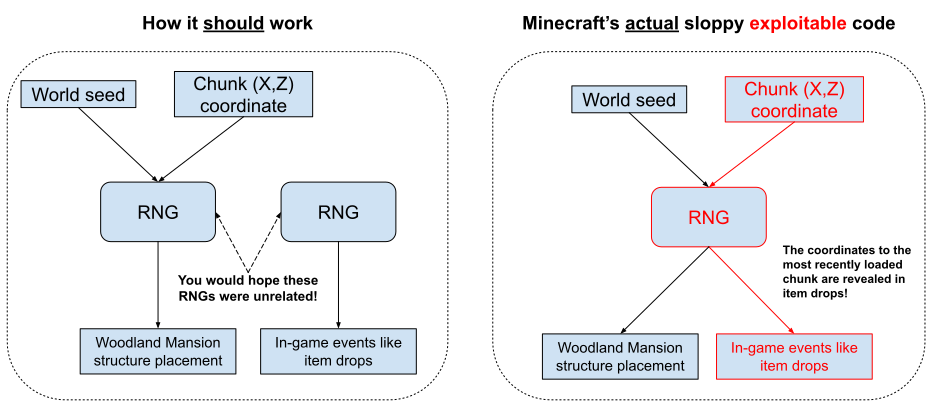
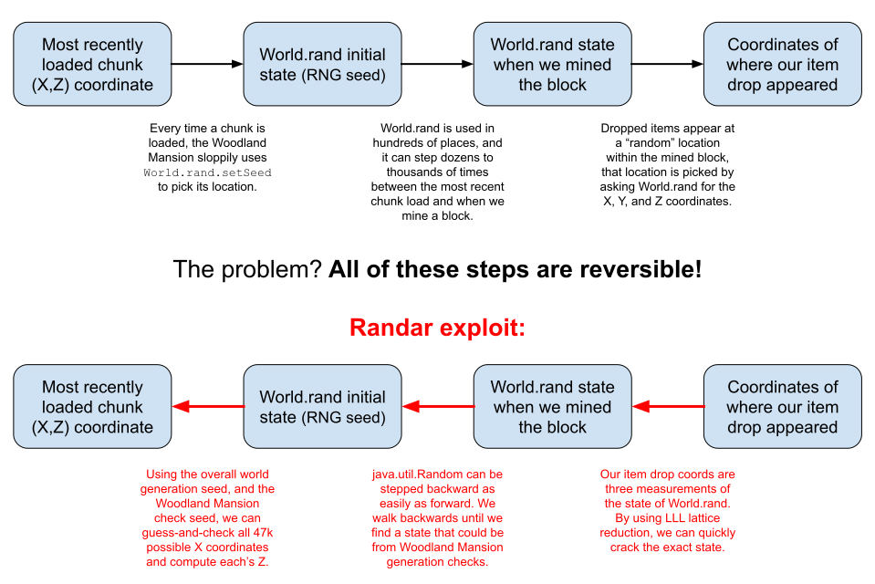
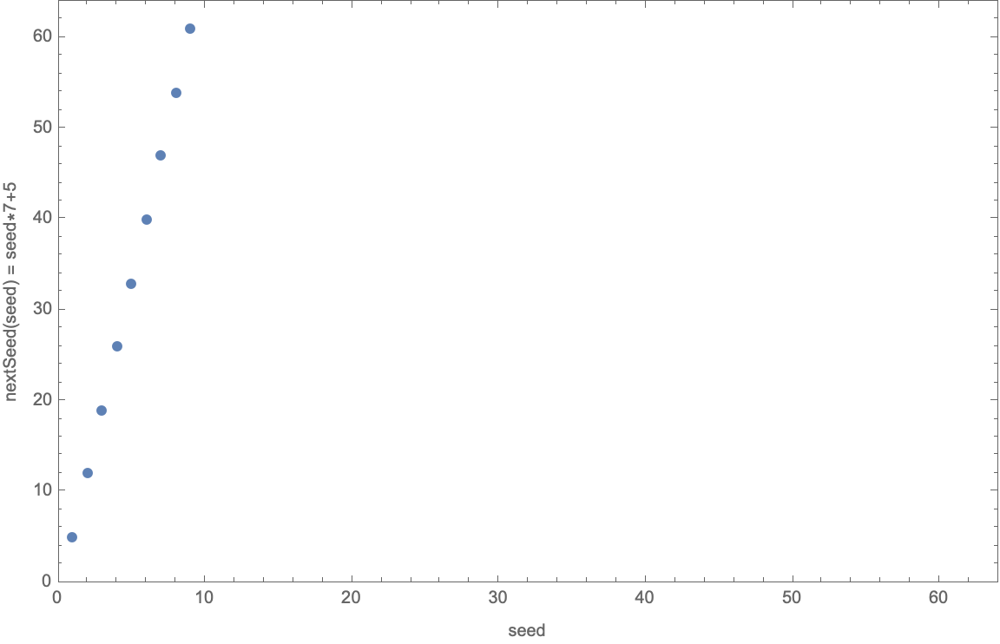
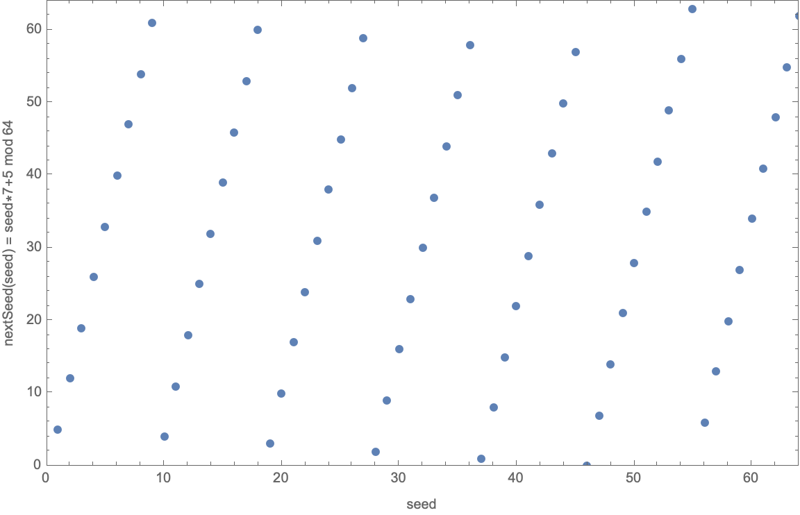
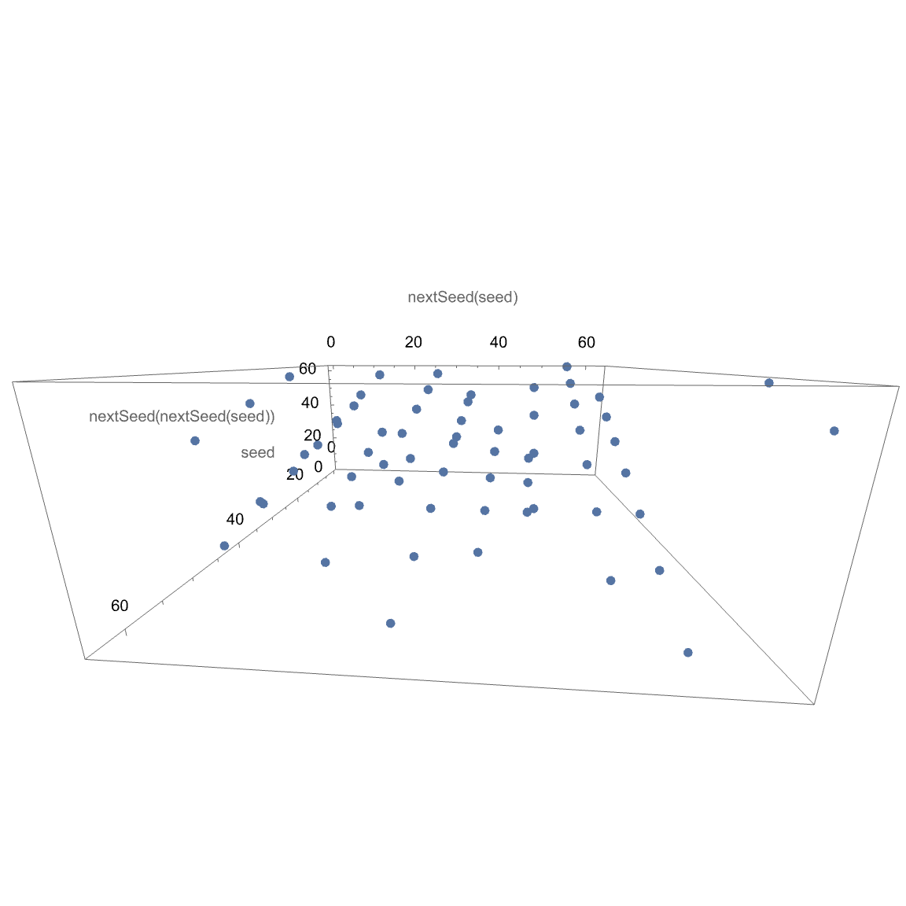
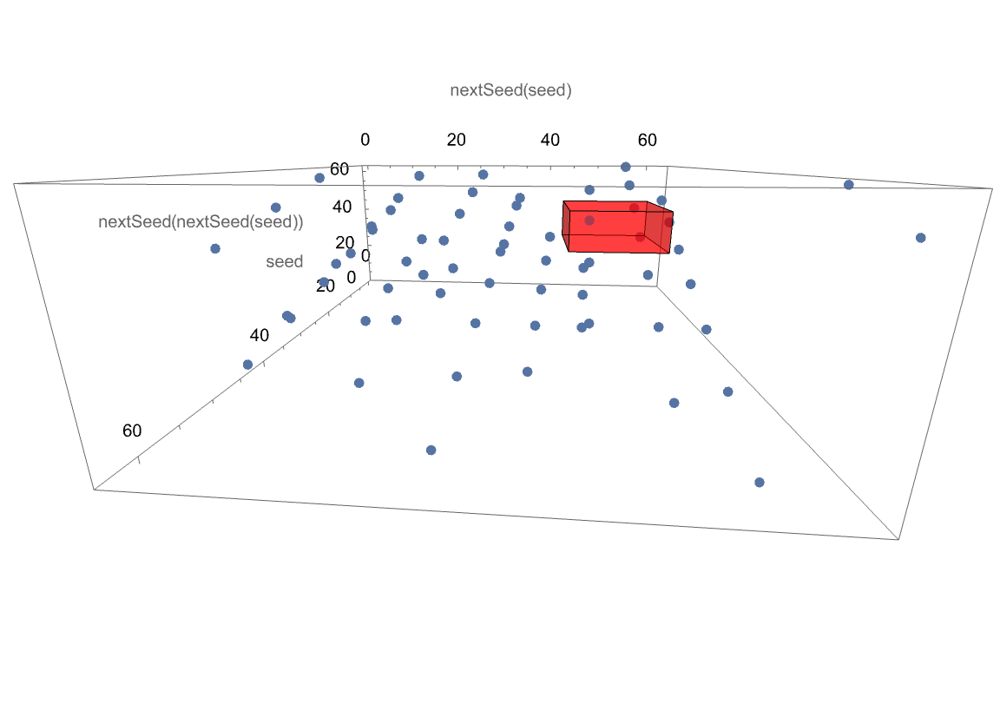

# Randar Explanation and Information

What if I told you, that every time a block is broken in Minecraft versions Beta 1.8 through 1.12.2, the precise **location** of the dropped item can reveal **someone else's location**?

"Randar" is an exploit for Minecraft, which uses [LLL lattice reduction](https://en.wikipedia.org/wiki/Lenstra%E2%80%93Lenstra%E2%80%93Lov%C3%A1sz_lattice_basis_reduction_algorithm) to determine (i.e. crack) the internal state of one of the Minecraft server's `java.util.Random` instances, then works backwards from that to abuse a flaw in the way this RNG is used to remotely locate other players.

**The goal** is to determine the in-game locations (i.e. coordinates) of the other players in the world, no matter how far away they are. We're playing on [2b2t](https://en.wikipedia.org/wiki/2b2t), which is the oldest and most famous "anarchy" Minecraft server (which means no rules, i.e. players aren't banned for any reason). Doing stuff like this is kind of "the point" on this server. On this server, the only thing keeping your stuff safe is that the map is huge (3.6 quadrillion square tiles) and no one else knows where you are. So it's a huge deal (a game-breaking deal) to have a coordinate exploit. (speaking of, before Randar we also had another coord exploit on 2b2t, Nocom, from 2018 to 2021; see that writeup [here](https://github.com/nerdsinspace/nocom-explanation/blob/main/README.md), [HackerNews thread](https://news.ycombinator.com/item?id=29615428), [YT](https://www.youtube.com/watch?v=elqAh3GWRpA))

**The mistake** in Minecraft's code is present from versions Beta 1.8 (released 2011) through 1.12.2 (released 2017, but 2b2t stayed on this version until August 14, 2023). The mistake is that various instances of the random number generator, `java.util.Random`, are reused sloppily in various parts of the code (and they're insecure to begin with). Specifically, there's reuse of RNG between generating terrain and in game actions such as mining blocks.

**The exploit** summarized:

1. Some player on the server (our victim) walks around, causing a chunk (a 16x16 blocks section of the map) to be loaded into memory server-side. This happens normally all the time.
2. The server checks if certain structures are being generated in that chunk, and the last one to be checked is the [Woodland Mansion](https://minecraft.fandom.com/wiki/Woodland_Mansion). Due to sloppy code in Minecraft, the global `World.rand` has its seed reset to a function of the chunk coordinates, in order to check where a nearby Woodland Mansion should be (and whether it's this chunk in particular).
3. One of our bot players, also on 2b2t but at an unrelated location, mines a block very soon after. The dropped item appears at a "random" coordinate within the mined block, determined by three consecutive `World.rand.nextFloat()` calls to pick the X Y and Z coordinates between 0 and 1. The bot records the timestamp and the precise X Y Z values.
4. By using lattice reduction, we can determine the exact internal state of `World.rand` that caused those three floats. Broadly speaking (more detail will come later), observing one output of the RNG could imply any one of about 16 million possible internal states of the RNG. However, we have sampled the output of the RNG not just once but three times in a row (the X, Y, and Z coordinates of the dropped item), and we know how the internal state is updated between each call (a simple multiply, add, then mod); therefore we can use lattice methods to essentially instantly narrow it down to the only possibility.
5. We step the RNG state backwards in time until we find one that could have been caused by a Woodland Mansion check. Again broadly speaking, the internal state of `java.util.Random` can be stepped backwards just as easily as forwards, and by stepping backwards we can find it in just a few thousand steps (even on busy servers like 2b2t with many players and therefore heavy usage of RNG), which identifies the most recent time that the RNG's internal state was reset, and therefore the location of the most recent chunk that was loaded on the server.
6. A heatmap is built up over time from that database, and we pay some of the hotspots a visit in game and maybe steal their stuff or generally just cause chaos. To find a specific person, we can associate login times to hits, as logging in causes a lot of chunks to load immediately.

Randar was discovered by [n0pf0x](https://github.com/pcm1k) and this writeup was written by leijurv. Exploiters were [0x22](https://github.com/0-x-2-2), [Babbaj](https://github.com/babbaj), [TheLampGod](https://github.com/thelampgod), [leijurv](https://github.com/leijurv), [Negative_Entropy](https://github.com/Entropy5) and [rebane2001](https://github.com/rebane2001).

Diagram of the mistake:


Diagram of the exploit:


## Brief history

In 2018, Earthcomputer and friends discovered that chunk loads affect the game's RNG in an observable way, see [this](https://youtu.be/Bl2lan-44H8?t=362) explanation. However, they did not realize, or just never revealed publicly, that you can also do this backwards, determining the most recent loaded chunk from observing the RNG. That discovery, Randar, was made by n0pf0x (aka pcm1k, aka n0pdr0pz) in October 2022. He posted a short, encrypted description of the exploit on [Pastebin](https://pastebin.com/afCrvAzJ) shortly after, to [prove](https://en.wikipedia.org/wiki/Trusted_timestamping) that he discovered it then. He used the exploit mostly on [9b9t](https://9b9t.com/), and only a relatively small amount on 2b2t and other servers. On 2b2t, n0p located and explored various locations, eventually coming to a [Gringotts](https://www.youtube.com/watch?v=TMBHP9FDqHI) stash location. He was spotted by rebane2001, and initially silent about how he found the location. However, about a month later, he began a conversation with the SpawnMasons about it. n0p revealed he had used a powerful coordinate exploit and decided to share [an explanation](media/randar_n0p_2022.txt) with us in April 2023, because the masons have past experience taking advantage of 2b2t exploits at larger scale, so it would be fun to see that happen again, and n0p was getting slightly bored with it anyway. We accepted and began recording item drop coordinates on several accounts that were already mining stone/cobblestone 24/7 for an unrelated project (so, there was no change in behavior). We reused the headless Minecraft system from nocom and added a Postgres database to record the measurements. As discussed later in this readme, we went through several iterations of software to crack the RNG measurements, eventually settling on an async Cuda batch job. As cracked measurements were added to the database, we also updated an analytics table with heatmap information that counted hits at each coordinate at intervals of all time, daily, and hourly. This allowed a simple Plotly Dash UI to select heatmap data from specific time ranges and granularities for display in a browser, and it let us remove all the Elytra stashhunting chunk load spam by only considering coordinates that were loaded in more than a few distinct hours. We added a simple shared annotation system to keep track of what we found at each hotspot on the map. Again reusing from Nocom, we have Baritone bots that automate the entire process of stealing item stashes and sorting the results, completely AFK. Many masons helped with this part, without knowing the exploit, using accounts such as `munmap` and `1248_test_user`. All Gringotts stashes put together eventually grew to 1.3 billion items, of which about half is attributable to Nocom and half to Randar.

## More detail

Minecraft's map is procedurally generated and essentially deterministic based on the initial seed of the world. As players explore the map, new areas are generated on-demand as players get near. Since all the generation is meant to be repeatable (deterministic), it's perfectly reasonable for them to have used `java.util.Random` in a lot of places. They **want** it to be predictable. This is why `java.util.Random` is used, since it's a PRNG (not really a RNG). The P technically means "pseudo" but think of it as "predictable". Predictable RNG. It generates numbers that seem random, but they're actually repeatable given the same starting seed.

Minecraft has various structures that are generated in the world, such as villages, ocean monuments, strongholds, etc. These are part of the procedural generation, so they're also placed and generated deterministically.

There's only a dozen lines of Minecraft code needed to understand this, and I've simplified and commented it heavily:

```java
// (chunkX,chunkZ) is being loaded, and this function checks if it should generate a Woodland Mansion
protected boolean canSpawnStructureAtCoords(int chunkX, int chunkZ) {

    // divide by 80, rounding down, to determine which "Woodland region" (my made up term) we're considering
    int woodlandRegionX = Math.floorDiv(chunkX, 80);
    int woodlandRegionZ = Math.floorDiv(chunkZ, 80);

    // seed the random number generator deterministically in a way that's unique to this Woodland region
    Random random = this.world.setRandomSeed(woodlandRegionX, woodlandRegionZ, 10387319);

    // pick which chunk within this region will get the Woodland Mansion
    int woodlandChunkX = woodlandRegionX * 80 + (random.nextInt(60) + random.nextInt(60)) / 2;
    int woodlandChunkZ = woodlandRegionZ * 80 + (random.nextInt(60) + random.nextInt(60)) / 2;

    // but is it *this* chunk, that we're loading right now?
    if (chunkX == woodlandChunkX && chunkZ == woodlandChunkZ) {
        // and, is this chunk in a biome that allows Woodland Mansions? (e.g. roofed forest)
        if (this.world.getBiomeProvider().areBiomesViable(chunkX * 16 + 8, chunkZ * 16 + 8, 32, ALLOWED_BIOMES)) {
            return true;
        }
    }

    return false;
}

// and here's what it calls in World.java:
public Random setRandomSeed(int seedX, int seedY, int seedZ) {
    this.rand.setSeed(seedX * 341873128712L + seedY * 132897987541L + seedZ + this.getWorldInfo().getSeed());
    return this.rand; // this.getWorldInfo().getSeed() is the overall seed of the entire map, which has been cracked long ago for 2b2t (it's -4172144997902289642)
}
```

The above is commented and slightly modified for clarity, but it's functionally accurate to the real code.

So the idea is to decide where the Woodland Mansion should go in this Woodland region (which is 80 by 80 chunks), check if that place is *right here*, and if so, generate a Woodland Mansion starting right here.

This code might look a little silly, you might be thinking "it's absurd to do all these checks on every chunk, just pick where Woodland Mansions should go once per region and be done with it". The reason is that Minecraft chunks are generated independently of each other, and in unknown order, yet we still want to generate a deterministic world from a given seed. We don't know in what order the player is going to walk around the world, and it's nice to be able to generate any chunk on-demand in a stateless manner. It's a good game experience. Thus, weird-looking code like this.

Anyway, that code gets called on every chunk load, for every chunk in a large square around the one being loaded. It's a bit complicated to explain why so I'll mostly skip it (the basic idea is that these structures are (much) larger than one chunk in size, so we need to check for a structure origin in many nearby chunks in order to generate this current one correctly).

Note that this only affects the Overworld. The Nether is safe, as all of its structure generation has always used safe RNG. Loading chunks in The End is affected due to end cities, but only on their initial generation, not every subsequent time they're loaded, thus The End is relatively safe because each chunk at your base only affects the RNG once ever when you first load it. However, this is not totally foolproof, as players commonly generate new chunks each time while travelling to their base, and occasionally generate new chunks while already at their base.

The problem is that it modifies the seed of the global `World.rand`. This is just lazy coding. All they're doing is calling `nextInt` four times to pick the X and Z coordinate. They could have replaced `Random random = this.world.setRandomSeed(...` with `Random random = new Random(the same stuff)` (in other words, make a new `Random` here rather than messing with the existing one that's used by everything else???).

Crucially, the `setRandomSeed` is called **in order to check** where the Woodland Mansion should go. It happens no matter what, on every chunk load, everywhere. You don't have to be standing in/near the Woodland Mansion or anything like that.

Well, turns out `World.rand` is used in literally hundreds of places, and many of those places can be easily observed by playing the game normally. For example, when you mine a block:

```java
/**
 * Spawns the given ItemStack as an EntityItem into the World at the given position
 */
public static void spawnAsEntity(World world, BlockPos pos, ItemStack stack) {
   double xWithinBlock = world.rand.nextFloat() * 0.5F + 0.25D;
   double yWithinBlock = world.rand.nextFloat() * 0.5F + 0.25D;
   double zWithinBlock = world.rand.nextFloat() * 0.5F + 0.25D;
   EntityItem entityitem = new EntityItem(world, pos.getX() + xWithinBlock, pos.getY() + yWithinBlock, pos.getZ() + zWithinBlock, stack);
   world.spawnEntity(entityitem);
}
```

Again, slightly modified, but functionally accurate for the stuff we're talking about.

The idea here is that in Minecraft when you mine a block, it drops an item. The item is dropped at a random position within the block. For example, if the block was at `(10, 20, 30)`, the item will appear somewhere between `(10.25, 20.25, 30.25)` and `(10.75, 20.75, 30.75)`.

And the exact location of that item is chosen by calling `world.rand.nextFloat()` three times in a row, for the X, the Y, and the Z.

**That's all the Minecraft code needed!**

Now, I said that we can do something with these `nextFloat` calls. First, let's see if we can "work backward" to see what the `nextFloat` calls are. It's pretty lucky, but we actually can. Note in the above code: the random float is multiplied by 0.5, then added to 0.25. The idea is to move from a random number between 0 and 1 to a random number between 0.25 and 0.75. You might be worried, because if you were to divide an integer by two, you'd lose a bit of information since the result is rounded down. Thankfully, multiplying a float by 0.5 is totally reversible, since it just decrements the exponent while leaving the mantissa untouched. Then, the float is casted to a double, which has way more precision. 0.25 is added, then the block coordinate is added. Then, it's sent to the client over the network in full precision. The upshot: this whole process is reversible so we can get the exact three floats that `World.rand.nextFloat()` produced.

How does `java.util.Random` generate floats? Well actually it's quite simple. It generates an integer between 0 and 2^24, then divides it by 2^24 (resulting in a number between 0 and 1).
How does it get that random integer? Also pretty simple! It's a [linear congruential generator (LCG)](https://en.wikipedia.org/wiki/Linear_congruential_generator). That means that the next seed is the previous seed times something, plus something else, modulo something else.

```java
public float nextFloat() {
   this.seed = (this.seed * multiplier + addend) % modulus; // update the seed
   int randomInteger = (int) (this.seed >> 24); // take the top 24 bits of the seed
   return randomInteger / ((float) (1 << 24)); // divide it by 2^24 to get a number between 0 and 1
}
```

In this case, the multiplier is 25214903917, the addend is 11, and the modulus is 2^48.

With the float that came out of this, we can multiply it by 2^24 to get back the randomInteger, and therefore get the "top half" (the most significant 24 bits) of the 48 bit seed.

In short, from our measurement, we learn that the seed is between `measuredRandomInteger * 2^24` and `(measuredRandomInteger + 1) * 2^24`.

And we can do this three times in a row, for the X, the Y, and the Z.

And we know that between the X and the Y, and between the Y and the Z, the seed was updated according to `newSeed = (oldSeed * 25214903917 + 11) mod 2^48`

I must mention that one valid option is a for-loop that tries all 2^24 possible lower bits. For the programmers reading this, I hope this makes clear what the problem is:

```java
for (long seed = firstMeasurement << 24; seed < (firstMeasurement + 1) << 24; seed++) {
    // all these seeds will match the first measurement
    if (nextSeed(seed) >> 24 == secondMeasurement && nextSeed(nextSeed(seed)) >> 24 == thirdMeasurement) {
        // if nextSeed(seed) matches secondMeasurement, and nextSeed(nextSeed(seed)) matches thirdMeasurement
        // then we found a seed that matches all three measurements! yay!
        return seed;
    }
}
```

This would work, and does work, but it's not that fast and not that fun. So we use lattices instead!

However, I feel like I have to go a bit out of order. The lattice reduction part does come in right here but it's really complicated and I bet it would have low reader retention and I don't want to lose you. So I'll just give you that for-loop solution (which DOES work), and continue to the next step of the exploit. The explanation of the lattice reduction method will come right after :)

**What do we do with this seed once we have it?**

First, note that we can step the LCG backwards. Obviously, adding eleven is reversible, but is multiplying by that big number reversible? Our multiplier `25214903917` is an odd number, meaning it isn't divisible by two, and therefore it doesn't share any factors with our modulus 2^48 (since 2^48 is literally just a bunch of twos). Since it's relatively prime to the modulus, we can [invert it](https://en.wikipedia.org/wiki/Modular_multiplicative_inverse), which means to find another number `x` that satisfies `x * 25214903917 - 1` is divisible by 2^48. Or in other words, `25214903917 * x mod 2^48 = 1`. That number [is `246154705703781`](https://www.wolframalpha.com/input?i=25214903917%5E-1+mod+2%5E48). This helps invert the multiplication because if we have, for example, `secret * 25214903917` and we want to figure out `secret`, we can just compute `secret * 25214903917 * 246154705703781 mod 2^48 = secret * 1 mod 2^48 = secret`.

Ok, so we can step the internal seed of `java.util.Random` both forwards and backwards. Forwards is `newSeed = (oldSeed * 25214903917 + 11) mod 2^48` and backwards is `oldSeed = ((newSeed - 11) * 246154705703781) mod 2^48`. And this works because those numbers `25214903917` and `246154705703781`, when multiplied together, come out to `1` when you take it mod 2^48.

Now, as we step backwards, we would like to check at each step whether this seed could mean that a Woodland Mansion check was recently performed somewhere in the world (the whole point of the exploit). How do we do that?

The Minecraft world ranges from -30 million to +30 million blocks. Each "Woodland region" (an area of the world where a single Woodland Mansion is placed at random, as per the code shown previously) is 80 by 80 chunks, which is 1280 by 1280 blocks. This is 23437.5 Woodland regions, but for all of our code we just rounded up to 23440 because it's a round number and even though your player can't travel beyond 30 million, you load chunks beyond it just by standing near it, and we just didn't want to have to worry about all that.

So, -23440 to +23440 on both X and Z axes. That's `(23440*2+1)^2` (aka `2197828161`) possible Woodland regions, each of which generates a unique "mansion seed" (defined as a seed that reveals that someone just loaded a chunk at a certain Woodland region). We need to be able to check if something is a mansion seed. Could we iterate over all 2.2 billion mansion seeds to check each one? Would be too slow. Could make a `HashSet<Long>` with 2.2 billion entries? Would take up too much RAM even using [chronicle map](https://github.com/OpenHFT/Chronicle-Map) like we [did in nocom](https://github.com/nerdsinspace/nocomment-master/blob/master/src/main/java/nocomment/master/slurp/SlurpManager.java#L102), and even in C++ using `abseil-cpp` it used like 50gb ram. And that's not to mention the other part: we actually want to learn where they are in the world (that's the whole point). So it's not good enough to learn this is a mansion seed, we also want to (efficiently) learn which Woodland region caused it.

Recall the function that goes from Woodland Region to mansion seed (note: I've now combined some constants since the code above for simplicity, *this equation is now specialized to 2b2t's seed*):

```
seed = x * 341873128712 + z * 132897987541 - 4172144997891902323 mod 2^48
```

(the `-4172144997891902323` number comes from the `-4172144997902289642 + 10387319`, which is the 2b2t world seed + the magic value used for seeding the Woodland region (as shown earlier). For any other world you would just put your own seed instead into this equation.)

Not much we can do with the x coordinate, since it's being multiplied by an even number. But what's that coefficient on the z coordinate? It looks like an odd number!!! Let's use the same trick as before to [invert it](https://en.wikipedia.org/wiki/Modular_multiplicative_inverse) again, and [we get `211541297333629`](https://www.wolframalpha.com/input?i=132897987541%5E-1+mod+2%5E48).

Let's imagine we have a given seed. What if we could just iterate through all possible X coordinates from -23440 to +23440, and for each one, **compute what the Woodland region's Z coordinate WOULD be, IF it had this mansion seed**. In other words, the above equation gives us `seed` if we know `x` and `z`, but can we make an equation that gives us `z` if we know `seed` and `x`? Answer: yes. We just rearrange the above equation, and use the fact that the coefficient of Z is invertible mod 2^48 since it's an odd number.

The equation is:

```
z = (seed + 4172144997891902323 - x * 341873128712) * 211541297333629 mod 2^48
```

So this is a pretty good solution because instead of two nested loops (one for X and one for Z) that do a total of 2.2 billion iterations, we can have a single for-loop for X that just does 46,881 iterations. Here it is in Java:

```java
private static WoodlandRegionCoord woodlandValid(long internalSeed) {
    long seed = 25214903917 ^ internalSeed; // java.util.Random XORs in the multiplier while doing setSeed, so XOR that back out to go from a "this.seed" to what the input to setSeed() would be
    for (int x = -23440; x <= 23440; x++) {
        long z = ((seed + 4172144997891902323L - x * 341873128712L) * 211541297333629L) << 16 >> 16;
        if (z >= -23440 && z <= 23440) {
            return new WoodlandRegionCoord(x, z);
        }
    }
    return null;
}
```

(note: the weird `<< 16 >> 16` is doing mod 2^48, but we actually want to do it using signed types so that we still get the correct answer when z is between -23440 and 0, this is a way to sign-extend the 48-bit number to 64 bits, filling the upper 16 bits with the correct sign bit for two's complement)

So this does work and it's reasonably fast.... for a single seed. But remember that we're stepping back the RNG for potentially thousands of steps, and running this check at each step until we find a match. At the time, we were using a shitty DigitalOcean droplet on their lowest tier, and this was actually lagging everything out and couldn't keep up with real time (bots mining many blocks per second, each block taking thousands of rng steps to crack, and each rng step taking 23440*2+1 operations to check, multiply those together and you get well into the hundreds of millions of operations per second, so you see why that had trouble on a crappy VPS, especially when that VPS is also trying to run multiple headless instances of Minecraft).

Anyway so we switched to a lookup table approach and rewrote it in Cuda to run on my desktop as a batch job every few minutes. It can do literally millions per second because each of the thousands of cuda cores can work on their own seed in parallel. Here's the idea: the lookup table's key is the lower 32 bits of the mansion seed, and the value is the X coordinate of the Woodland region. This lookup table works with no collisions because each mansion seed has a unique lower 32 bits, **somehow**. I don't understand why that's true, it's fascinating. You'd think it wouldn't work. But I think the coefficients `341873128712` and `132897987541` may have been specially chosen to make this work? Like, if you have 2.2 billion marbles, and 4.3 billion buckets, and you independently put each marble in a random bucket, what are the odds that each marble gets its own bucket? Essentially zero. Nearing the end, each new marble has a more than 50% chance of hitting a bucket that's already filled. Yet, clearly, these are not independently random, so somehow it works. Unironically if you're reading this and understand how this works or why those two specific coefficients make this work, please let me know. Anyway, it works. The lookup table has 2^32 entries, and each entry is 2 bytes (since it's just a number between -23440 and +23440), so this needs about 9 gigabytes of VRAM on your GPU.

The woodland check function now looks like (again, this is the actual code but simplified, all helpers and constants inlined etc):

```cpp
__global__ void computeSteps(const int16_t* mansionTable, const int64_t* seedsArr, Result* resultArr, size_t numData) {
    auto tid = blockIdx.x * blockDim.x + threadIdx.x;
    [[unlikely]] if (tid >= numData) {
        return;
    }
    auto seed = seedsArr[tid];
    int steps = 0;
    while (true) {
        auto externalSeed = seed ^ 25214903917;
        const auto x = mansionTable[externalSeed & ((1LL << 32) - 1)];
        const auto z = ((externalSeed + 4172144997891902323LL - (int64_t) x * 341873128712LL) * 211541297333629LL) << 16 >> 16;
        if (z >= -23440 & z <= 23440) {
            resultArr[tid] = {.startSeed = seedsArr[tid], .x = (int16_t) x, .z = (int16_t) z, .steps = steps};
            return;
        }
        seed = ((seed - 0xBLL) * 0xdfe05bcb1365LL) & ((1LL << 48) - 1); // prevSeed(seed)
        steps++;
    }
}

// and that mansionTable was generated like this
// note: mansionTable must be calloc'd before this function because not every entry will be written to, and an x value outside -23440 to 23440 bounds could create a false positive later on while using the table
__global__ void writeToSeedTable(int16_t* mansionTable) {
    auto tid = blockIdx.x * blockDim.x + threadIdx.x;
    if (tid >= (23440 * 2 + 1) * (23440 * 2 + 1)) return;
    auto x = tid / (23440 * 2 + 1) - 23440;
    auto z = tid % (23440 * 2 + 1) - 23440;
    auto seed = ((int64_t) x * 341873128712LL + (int64_t) z * 132897987541LL - 4172144997891902323LL) & ((1LL << 48) - 1);
    mansionTable[seed & ((1LL << 32) - 1)] = (int16_t) x;
}
```

This works great in giant batches and can crack on the order of ten million seeds per second on a 3090. Turns out to not be too big of a deal when some of the threads in a warp terminate early, and we couldn't really make it any faster than this. (the reason is that we fundamentally can't know beforehand which seeds will take more/less steps).

Well that's about it. Given the seed, that's how we get the Woodland region in the world where the most recent chunk load happened. In other words, we just learned that the most recent time that someone walked around on 2b2t and loaded a new area of the world, was somewhere within *this* 1280 by 1280 block Woodland region that we just identified. (that's precise enough that locating them takes just a few minutes of searching)

Now back to the fun part, lattices!

## Lattice reduction

We'll reframe the problem as finding a point in a 3d lattice. To reiterate, we have made three consecutive measurements of the most significant 24 bits of the internal seed of `java.util.Random`. Additionally, we know exactly how the seed was updated between our measurements (it's just `nextSeed(seed) = (seed * 25214903917 + 11) mod 2^48`). We want to determine the entire 48-bit seed (aka: figure out what the lower 24 bits are).

In more formal terms, `seed` is a secret number between 0 and 2^48 that we want to figure out. We know that `seed` is between `m1*2^24` and `(m1+1)*2^24`, `nextSeed(seed)` is between `m2*2^24` and `(m2+1)*2^24`, and `nextSeed(nextSeed(seed))` is between `m3*2^24` and `(m3+1)*2^24` (where `m1`, `m2`, and `m3` are shorthand for our three measurements).

This can be done faster than brute force because the `nextSeed` function is not really all that random.

Let's rewrite `nextSeed(seed) = (25214903917*seed+11) mod 2^48` as `nextSeed(seed) = (seed * a + b) mod c`, just so that I'm not spamming long numbers everywhere.

Let's visualize the problem with these kind of [linear congruential generators](https://en.wikipedia.org/wiki/Linear_congruential_generator) (any generator of that ^ form, `seed*a+b mod c`).

What if we were to plot `seed` on the X axis, and `nextSeed(seed)` on the Y axis? It would look something like this to start: 



(note: I'm using fake numbers: `a=7`, `b=5`, and `c=64`, so that the plot is readable and has a manageable number of points (less than a trillion))

This should look familiar as a `y=mx+b` plot (except, it's `nextSeed(seed) = a*seed+b`). Very clearly **not** random, very clearly predictable.

Then, it approaches the modulus, and wraps around back to zero each time that happens:



So, you can visually see that this has a predictable structure, although it isn't quite a straight line anymore. This structure is called a [lattice](https://en.wikipedia.org/wiki/Lattice_(group)).

A lattice is a set of points in space that are all integer multiples of some vectors that form a basis for the lattice. Lattices have the property that you can add together any of its points, and get to another point in the lattice (e.g. if `(1,2)` and `(500, 700)` are points in the lattice, then `(501, 702)` must also be a point in the lattice). These plots are (almost) lattices (you just have to shift all the points by a bit, because lattices technically have to include the `(0,0)` point, we'll do this later). The intuition for lattices is that they're conceptually a grid, but, squish squashed in some way. If you sorta tilt your head, you can see how you could take a grid of points, squish/tilt them, and get this plot.

In our case, we get three measurements (not just two), so we'll actually be using a 3D plot where the Z axis is `nextSeed(nextSeed(seed))` (but the X and Y axes are still the same). Here's what that looks like:



The lattice pattern in 2d as lines is even more apparent in 3d as planes. (aside: this is actually [a test for PRNGs](https://en.wikipedia.org/wiki/Spectral_test), whether or not it makes planes like this, and if so, how far apart they are). 

Now, recall that our measurements give us three different bounds for each of `seed`, `nextSeed(seed)`, and `nextSeed(nextSeed(seed))`. Visually, our measurements form a cubic constraint in this space. Our overall plot is 2^48 on each side, and our three measurements define a cube of side length 2^24 (recall how our three measurements were imprecise, only narrowing down the seed to a range of 2^24 values, since we only saw the most significant 24 bits of a truly 48 bit seed). Simply put, if you know the X coordinate is in some range, Y is in some range, and Z is in some range, this constraint can be visualized as a cube. Our goal is to recover the original value of `this.seed`. **Crucial point, make sure you understand this:** If we can identify a lattice point within that cube, we'll have solved the problem. Our lattice points are of the form `(seed, nextSeed(seed), nextSeed(nextSeed(seed)))`, and our cube represents the constraints we've measured on those three things (the seed, the next seed, and the one after that). If we find an exact lattice point within that cube, it'll mean we've identified a seed that would have produced the measurements that we took (aka: `java.util.Random` has been successfully cracked). If we could identify such a point, its first coordinate will be the `this.seed` before the first `nextFloat` call, which is what we're trying to find with all this.

Here's a visualization of the problem: we have our lattice, and our measurements tell us the coordinates of the cube we need to search in (shown in red), now the problem is efficiently identifying a lattice point within that cube. And still keep in mind that while this GIF may make the problem look easy, this is NOT the real 3d plot, it's just a simplification, the real 3d plot has nearly 300 trillion points.



So, we have a 3d scatter plot of points, with one point for each possible seed. For every integer `seed` value from `0` to `2^48`, we have plotted a point at `(seed, nextSeed(seed), nextSeed(nextSeed(seed)))`. In other words, `(seed, seed*a+b mod c, (seed*a+b)*a+b mod c)`.

This 3d scatter plot **looks** like a lattice, but if we want to apply helpful mathematical tools from integer linear programing, we need to describe this lattice formally in mathematical terms that can be plugged into those tools. We do this by coming up with basis vectors that define the lattice. First, we've plotted all possible seed values, so let's formalize that by defining what happens as you increment the seed value by 1. That will fill out our lattice nicely starting from 0 and including every value by induction. When you add `1` to the seed, it adds `a` to the next seed, and `a^2` to the one after that (because `nextSeed(seed) = seed*a+b`). In other words, the plot is defined by a basis vector of `(1, a, a^2)`. You can add this to any lattice point and still be at a valid lattice point. Great, that's one basis vector done! What else defines this lattice? Well, you may notice that I neglected the `mod 2^48` (aka `mod c`). That modulo happens to both the second and third components (because, we have `nextSeed(seed)` and `nextSeed(nextSeed(seed)))`). When computing a modulo, keep in mind that it can be expressed as just subtracting `c` some number of times. Therefore, we'll also treat `(0, -c, 0)` and `(0, 0, -c)` as basis vectors. The reason is that as the multiplication goes above 2^48, it "wraps around" back down to zero, which is the exact same as subtracting 2^48 an integer number of times. Note that lattices are infinite by construction, but we'll only need to consider the points that are between 0 and 2^48 on all three axes. Those points between 0 and 2^48 are exactly the points that we want to care about, and they'll match up with our original 3d scatter plot.

Our three basis vectors are `(1, a, a^2)`, `(0, c, 0)`, and `(0, 0, c)`. (peeking back into reality, the actual numbers are `(1, 25214903917, 635791379543541942889)`, `(0, 281474976710656, 0)`, and `(0, 0, 281474976710656)`. Now you can see how that would be nasty and incomprehensible if I'd been using those all along!) (mirroring these vectors around zero doesn't affect anything, so I'll do `c` instead of `-c`)

Any point representing `(seed, nextSeed(seed), nextSeed(nextSeed(seed)))` is represented by some combination of adding and subtracting `(1, a, a^2)`, `(0, c, 0)`, and `(0, 0, c)`. That first vector will be added `seed` times, the second one will be subtracted however many times the modulo wraps around back to zero on the first `nextSeed` call, and the third one is the same but for the second `nextSeed` call.

(note that this technically isn't a lattice yet because it doesn't technically include `(0, 0, 0)`, it starts at `(0, nextSeed(0), nextSeed(nextSeed(0)))`, in other words `(0, b, a*b+b)`. That has to be subtracted from all our points first. I've been glossing over this because it would be confusing to mention in every sentence, and because it's really easy to account for; we'll just shift our measurements later on to subtract that out. Trust me, it's fine.)

We have plotted one point in 3d for every possible internal state of `java.util.Random`, and recall that our measurements form a cube in that space. We need to find which of the points we plotted is inside that cube.

Given the lattice structure, and a cubic constraint, we want to find any lattice point in that cube. We've successfully converted our problem into a standard mathematical procedure: find a lattice point within a given range. With this reframing, we can use standard integer linear programming tools (LLL basis reduction) to solve it efficiently.

Our lattice is defined by linear combinations of `(1, 25214903917, 635791379543541942889)`, `(0, 281474976710656, 0)`, and `(0, 0, 281474976710656)`. Those are huge and unwieldy numbers! Could we do better? We can! [LLL basis reduction](https://en.wikipedia.org/wiki/Lenstra%E2%80%93Lenstra%E2%80%93Lov%C3%A1sz_lattice_basis_reduction_algorithm) can give us three new, smaller, still integer vectors that result in **the exact same lattice**. A lattice point in the old basis is also a lattice point in the new basis, and vice versa.

This is the weirdest step, so here's a visual (and if this visual is still not enough but you're still curious, go read [this explanation](https://gist.github.com/EDDxample/38a9acddcd29f15af034fd91da93b8fa) (it's the one I used myself to understand this) and/or watch these three videos [one](https://www.youtube.com/watch?v=XVrR1WImOh8) [two](https://www.youtube.com/watch?v=mc9w2iD3Gzs) [three](https://www.youtube.com/watch?v=gsaV9gcLntM))


Here's an example from [this Wikipedia page](https://en.wikipedia.org/wiki/Lattice_reduction). Let's imagine we have our initial vectors `v1` and `v2`, drawn in black in this visual. By adding subtracting any number of `v1`s and `v2`s, we create a lattice, which is shown by the blue dots. But, as you can see, the blue dots are pretty densely packed, and `v1` and `v2` seem like a weird/unintuitive/suboptimal way of describing where the blue dots are. For example, `v1` and `v2` are very long, and point in nearly the same direction. Lattice reduction on `v1` and `v2` gives us better basis vectors `u1` and `u2` (drawn in red). By adding and subtracting any quantity of `u1` and `u2`, we get **the exact same set of blue points**, or in other words, `u1` and `u2` generate **the exact same lattice** as `v1` and `v2` did. But, these are much better vectors, because they're nearly perpendicular to each other, and they're very short (in this case, as short as can be).

In short, our lattice of `(seed, nextSeed(seed), nextSeed(nextSeed(seed)))` can be described with those three vectors we came up with, but we can also describe that same lattice in a better and more helpful way with some simpler, shorter, and more perpendicular vectors, and LLL is going to tell us what those vectors are.

Mathematica can do this:
```
a = 25214903917; b = 11; c = 2^48;
LatticeReduce[{{1, a, a^2}, {0, c, 0}, {0, 0, c}}]
```

Our new vectors are `(1270789291, -2446815537, 2154219555)`, `(-2355713969, 1026597795, 4110294631)`, and `(-3756485696, -2345310016, -2015749696)`. Note how they're all pretty small now! None are more than ten digits, while our previous basis vectors were bigger. Remember, any combination of these three new vectors will result in a point that also is a combination of our three original vectors. Their lattices are indistinguishable.

Now here's the cool part. We can take our range, the cube that represents our search space, and **transform it into a range in this reduced space** via a [change of basis](https://en.wikipedia.org/wiki/Change_of_basis). If we treat our new basis vectors as the columns of a matrix, then invert that matrix, we have a magic key that transforms points in lattice space, into points in reduced basis space. There are two crucial realizations for why this is helpful: 1. any point with integer coefficients in reduced basis space will become a valid lattice point when converted back into lattice space (since it's a matrix multiplication by the lattice basis vectors, which we can see are integers) 2. the new lattice basis vectors are much smaller and more perpendicular, so the transformed cube (really a polytope now) is very small. If it were larger, we might have to do some [complicated iterating through multidimensional space](https://github.com/mjtb49/LattiCG), but in this case, for these specific parameters used in `java.util.Random`, and given the fact that we get three consecutive samples not just two, this process works so well that we don't even need to transform the entire range of the cube. We can just pick the exact center of our cube (i.e. make a guess of a single point), convert to reduced basis space, and **just round to the nearest integer**. Recall that we're trying to find any lattice point in our cube, and any point with integer coefficients in reduced basis space represents a valid lattice point. So, if our cube contains any point with integer coefficients we're done, the problem is solved. The lattice basis reduction took the tricky problem of "find a nearby lattice point to this coordinate" and made it as simple as "reexpress the coordinate as a linear combination of the basis vectors, then just round all three coefficients to the nearest integer" (see the "worked example" section later for an example). This can only "go wrong" (produce the wrong answer) if rounding to the nearest integer took us from a point inside the transformed cube to a point outside, but assuming we're operating on good data (aka measurements that truly did come from `java.util.Random`), there will be an integer point in the transformed cube, so this does work every time (since our transformed cube is tiny). (again, the "worked example" section later on will make this clear and apparent). Anyway this integer point in reduced basis space becomes a valid integer point in lattice space, which solves the problem since we've found a valid lattice point within the cube.

### Worked example

Let's say we have a `java.util.Random` with `123123123123123` as its internal state. If we did `nextFloat` three times (exactly like in Minecraft), we would get `0.4374212`, `0.4570924`, and `0.3316006`. We're going to forget about `123123123123123` but try to recover it from just those three floats.

The code of `nextFloat`, for reference:

```java
public float nextFloat() {
   this.seed = (this.seed * multiplier + addend) % modulus; // update the seed
   int randomInteger = (int) (this.seed >> 24); // take the top 24 bits of the seed
   return randomInteger / ((float) (1 << 24)); // divide it by 2^24 to get a number between 0 and 1
}
```

These three floats, `0.4374212`, `0.4570924`, and `0.3316006`, came internally from these 24-bit integers: `7338710`, `7668738`, and `5563335` (aka the three floats have those numbers as numerator and 2^24 as denominator). This measures the most significant 24 bits of the internal seeds. In other words, we only learn that the first seed value is between `7338710*2^24` and `7338711*2^24`, the second seed is between `7668738*2^24` and `7668739*2^24`, and the third is between `5563335*2^24` and `5563336*2^24`. The first seed was truly `123123123123123`, as we picked, and our first measurement already has narrowed it down to between `123123122831360` (aka `7338710*2^24`) and `123123139608576` (aka `7338711*2^24`).

To simplify things, we can take the center of our range. The center of this cube is at `(7338710*2^24 + 2^23, 7668738*2^24 + 2^23, 5563335*2^24 + 2^23)` or in other words `(123123131219968, 128660082262016, 93337281363968)`. For sake of mathematical correctness: we should also subtract `(0, b, a*b+b)` here as mentioned earlier, to make the reduced basis space start at `(0, 0, 0)`, but that doesn't realllly matter and it happens to actually work without it, but let's just do it to be correct:

So we want a lattice point "somewhere near" `(123123131219968, 128660082262005, 93059917420870)`. Even though that first coordinate (what we really want to find) is totally off, the second two coordinates give us enough information that we'll figure out the original first coordinate just fine! The reason is that in 3d space, the points are far apart so even if all three coordinates are off by millions, considering them all *put together* will let us end up at the correct answer. (48 bits of entropy, 24*3=72 bits of measurement, it ends up being pretty easy and unambiguous, and LLL basis reduction makes that easiness apparent)

Now, let's convert to lattice basis space. Mathematica code: `Inverse[Transpose[LatticeReduce[{{1, a, a^2}, {0, c, 0}, {0, 0, c}}]]] . {123123131219968, 128660082262005, 93059917420870}`

This gives: `(-10000.99799, 7761.998172, -41027.00033)`. Wow, that's so close to an integer! **That's why this works.** The critical realization: in this reduced basis space, the real point is incredibly shockingly close to our approximate measurement, even though it was millions away in lattice space.

Let's round to the nearest integer! `(-10001, 7762, -41027)`. This represents a valid point in lattice space, since all three coefficients are now integers. Now, to find that point's real coordinates in lattice space, we take that times our basis vectors (i.e. `-10001` times `(12707...` plus `7762` times `(-23557...` plus `-41027` times `(-37564...`). We get `(123123123123123, 128660088296759, 93059919934059)`.

That first coordinate is our original seed `123123123123123`! Success! Given the output of three consecutive `nextFloat` calls, we successfully recovered what the internal state of `java.util.Random` must have been. (in the real exploit, at this point we would then step this seed backwards until it matched a mansion seed, revealing what Woodland region a player was just walking around in)

Aside: now, what if we used the original basis vectors of `(1, a, a^2)`, `(0, c, 0)`, and `(0, 0, c)` instead of the LLL reduced ones? (Code: `Inverse[Transpose[{{1, a, a^2}, {0, c, 0}, {0, 0, c}}]] . {123123131219968, 128660082262005, 93059917420870}`). We would get coefficients of `123123131219968`, `-11029534347.32617`, `-278108648828606394735.834469`. Well that's useless. The first component is already an integer, because our first basis vector starts with a `1` and the next two both start with a `0`. Rounding to the nearest integer would therefore do nothing to help us find the actual original seed. If we did so, we would get `Transpose[{{1, a, a^2}, {0, c, 0}, {0, 0, c}}] . {123123131219968, -11029534347, -278108648828606394736} + {0, b, a*b + b}` which is `123123131219968, 220470678913035, 46744522843834`. So, these are three valid consecutive seeds (the `nextSeed` of the first is the second, and `nextSeed` of the second is the third). So it didn't do anything really useful, it just ignored our second and third measurements entirely and make them match our crappy guess for the first measurement (`123123131219968`). That's why we need to use the good, short, and most importantly *nearly orthogonal* basis vectors from LLL. With the better basis vectors, all three component axes (our three measurements) are "treated more equally" so to speak, so it naturally tends towards a solution that balances all three components. This simple way focused on getting something that exactly matches first component while entirely ignoring the second two, but that's no good because each individual component is millions off, but, *when considered together*, there's one obvious nearby lattice point that the better basis vectors find simply by rounding.

Here's that same approach, but simplified and optimized (no need to read this):
```java
public static long crack(int rngMeasurement1, int rngMeasurement2, int rngMeasurement3) {
    long cubeCenterX = ((long)rngMeasurement1 << 24) + 8388608L;
    long cubeCenterY = ((long)rngMeasurement2 << 24) + 8388597L;
    long cubeCenterZ = ((long)rngMeasurement3 << 24) - 277355554490L;
    double basisCoeff0 = 9.555378710501827E-11 * cubeCenterX + -2.5481838861196593E-10 * cubeCenterY + 1.184083942007419E-10 * cubeCenterZ;
    double basisCoeff1 = -1.2602185961441137E-10 * cubeCenterX + 6.980727107475104E-11 * cubeCenterY + 1.5362999761237006E-10 * cubeCenterZ;
    double basisCoeff2 = -1.5485213111787743E-10 * cubeCenterX + -1.2997958265259513E-10 * cubeCenterY + -5.6285642813236336E-11 * cubeCenterZ;
    long seed = Math.round(basisCoeff0) * 1270789291L + Math.round(basisCoeff1) * -2355713969L + Math.round(basisCoeff2) * -3756485696L & 281474976710655L;
    long next = seed * 25214903917L + 11L & 281474976710655L;
    long nextNext = next * 25214903917L + 11L & 281474976710655L;
    return (seed >> 24 ^ rngMeasurement1 | next >> 24 ^ rngMeasurement2 | nextNext >> 24 ^ rngMeasurement3) != 0L ? -1L : seed;
}
```

This has some additional sanity checking at the bottom (to make sure it's a real crack and not garbage-in-garbage-out), and I also changed it slightly for this example (the real version steps the seed back by one LCG step as a final step, just because `java.util.Random` actually steps the seed *before* returning the float, rather than after).

`crack(7338710, 7668738, 5563335)` (those are the three measurements from earlier) will return `123123123123123` as expected.

The idea of that code is:
1. `(cubeCenterX, cubeCenterY, cubeCenterZ)` are the x,y,z coordinates of the center of the cube in lattice space. Their offsets are 8388608 (aka 2^23) minus the `(0, b, a*b+b)` offset mentioned earlier.
2. `(basisCoeff0, basisCoeff1, basisCoeff2)` are the coefficients of the center of the cube in reduced basis space. Those nine random looking multipliers are `Inverse[Transpose[LatticeReduce[{{1, a, a^2}, {0, c, 0}, {0, 0, c}}]]]` (in other words, treating the reduced basis vectors like the columns of a matrix, then doing a change of basis onto them by left multiplying by the inverse of that basis matrix)
3. `(roundedCoeff0, roundedCoeff1, roundedCoeff2)` are those coefficients rounded to the nearest integer.
4. The `seed` is found by multiplying the first component of the three reduced basis vectors by our reduced basis coordinates. We only care about the first component of course, since that's the seed.
5. `(seed, next, nextNext)` are the seeds that would produce those three measurements, we compute `next` and `nextNext` just to make sure we're right. We could have gotten `next` and `nextNext` by computing the second and third components of the vector in the previous step, but it's faster to just do the LCG step directly.
6. We return -1 if the computation failed (e.g. garbage data), and the actual seed if it succeeded.

Yeah so that's how you get the state of `java.util.Random` from three consecutive calls to `nextFloat()`. And that ^ optimized Java code can do it in about ten nanoseconds on my laptop.

## Could you do this in redstone? (yes)
Here's a fun thought: if cracking the state of Minecraft's RNG is plainly fairly doable in not too many lines of code, as seen above, could it be implemented **in-game**? Like, within Minecraft itself, using redstone circuits? The answer is yes, go watch [this video](https://www.youtube.com/watch?v=YlacogJeVkg) which is honestly more impressive than anything we've done here. The guys who made that, Matthew Bolan and Earthcomputer and co., were the ones who actually discovered RNG manipulation and lattice methods as applied to Minecraft (years and years before we did anything with it).

## Complete worked example

```java
private static long WORLD_SEED = -4172144997902289642L; // change this for a server other than 2b2t

public static void receivedPacket(Packet<?> packet) { // call this for incoming packets
    if (packet instanceof SPacketSpawnObject) {
        SPacketSpawnObject obj = (SPacketSpawnObject) packet;
        if (obj.getType() == 2 && obj.getData() == 1 && obj.getSpeedY() == 1600) {
            new Thread(() -> crackItemDropCoordinate(obj.getX(), obj.getY(), obj.getZ())).start();
        }
    }
}

private static void crackItemDropCoordinate(double dropX, double dropY, double dropZ) {
    float spawnX = ((float) (dropX - (int) Math.floor(dropX) - 0.25d)) * 2;
    float spawnY = ((float) (dropY - (int) Math.floor(dropY) - 0.25d)) * 2;
    float spawnZ = ((float) (dropZ - (int) Math.floor(dropZ) - 0.25d)) * 2;
    if (spawnX <= 0 || spawnX >= 1 || spawnY <= 0 || spawnY >= 1 || spawnZ <= 0 || spawnZ >= 1) {
        System.out.println("Skipping this item because its coordinates are out of bounds. This probably means that the item only coincidentally looked like an item that was dropped from mining a block. Other ways to drop items (e.g. dropping from a player's inventory) can sometimes cause false positives like this.");
        return;
    }
    int measurement1 = (int) (spawnX * (1 << 24));
    int measurement2 = (int) (spawnY * (1 << 24));
    int measurement3 = (int) (spawnZ * (1 << 24));
    long cubeCenterX = ((long) measurement1 << 24) + 8388608L;
    long cubeCenterY = ((long) measurement2 << 24) + 8388597L;
    long cubeCenterZ = ((long) measurement3 << 24) - 277355554490L;
    double basisCoeff0 = 9.555378710501827E-11 * cubeCenterX + -2.5481838861196593E-10 * cubeCenterY + 1.184083942007419E-10 * cubeCenterZ;
    double basisCoeff1 = -1.2602185961441137E-10 * cubeCenterX + 6.980727107475104E-11 * cubeCenterY + 1.5362999761237006E-10 * cubeCenterZ;
    double basisCoeff2 = -1.5485213111787743E-10 * cubeCenterX + -1.2997958265259513E-10 * cubeCenterY + -5.6285642813236336E-11 * cubeCenterZ;
    long seed = Math.round(basisCoeff0) * 1270789291L + Math.round(basisCoeff1) * -2355713969L + Math.round(basisCoeff2) * -3756485696L & 281474976710655L;
    long next = seed * 25214903917L + 11L & 281474976710655L;
    long nextNext = next * 25214903917L + 11L & 281474976710655L;
    if ((seed >> 24 ^ measurement1 | next >> 24 ^ measurement2 | nextNext >> 24 ^ measurement3) != 0L) {
        System.out.println("Failed to crack the seed. This probably means that the item only coincidentally looked like an item that was dropped from mining a block. Other ways to drop items (e.g. dropping from a player's inventory) can sometimes cause false positives like this.");
        return;
    }
    long origSeed = seed;
    for (int i = 0; i < 5000; i++) {
        for (int x = -23440; x <= 23440; x++) {
            long z = (((seed ^ 25214903917L) - WORLD_SEED - 10387319 - x * 341873128712L) * 211541297333629L) << 16 >> 16;
            if (z >= -23440 && z <= 23440) {
                System.out.println("Item drop appeared at " + dropX + " " + dropY + " " + dropZ);
                System.out.println("RNG measurements are therefore " + measurement1 + " " + measurement2 + " " + measurement3);
                System.out.println("This indicates the java.util.Random internal seed must have been " + origSeed);
                System.out.println("Found a woodland match at woodland region " + x + " " + z + " which would have set the seed to " + seed);
                System.out.println("Located someone between " + (x * 1280 - 128) + "," + (z * 1280 - 128) + " and " + (x * 1280 + 1151) + "," + (z * 1280 + 1151));
                return;
            }
        }
        seed = (seed * 246154705703781L + 107048004364969L) & 281474976710655L;
    }
    System.out.println("Failed to crack. This probably means that your world seed is incorrect.");
}
```

For example, I pasted this into `jshell`, then I ran an actual coordinate that we measured on 2b2t. (although, I've replaced the actual block part of the coordinate with zero to not reveal where our bot was):

```
jshell> crackItemDropCoordinate(0.41882818937301636, 0.6833633482456207, 0.46088552474975586)
Item drop appeared at 0.41882818937301636 0.6833633482456207 0.46088552474975586
RNG measurements are therefore 5664934 14541261 7076144
This indicates the java.util.Random internal seed must have been 95041827771683
Found a woodland match at woodland region -12008 0 which would have set the seed to 275473502409504
Located someone between -15370368,-128 and -15369089,1151

jshell> 
```

And would you look at that, hidden deep within the digits of the coordinates of that item drop, the server was secretly revealing to us that there's someone on the -x highway at 15.4 million out. This secret information has been present in every item drop, on every server, on every version of the game until 1.13. (For earlier than 1.11, you'll need other code because the exploitable structure is something else (not Woodland Mansion), starting when the Village was added as the first structure in Beta 1.8).
